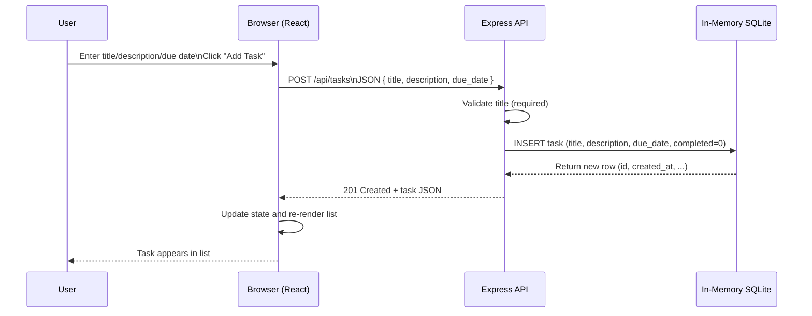

# Cloud/System Architecture Overview

This monorepo contains a React frontend and an Express API backed by an in-memory SQLite store. The MVP operates locally without external services.

## System Context (Mermaid)

```mermaid
flowchart LR
  user[User Browser]
  subgraph Monorepo (npm workspaces)
    fe[React Frontend (packages/frontend)]
    api[Express API (packages/backend)]
    db[(In-Memory SQLite DB)]
  end

  user --> fe
  fe -->|HTTP/JSON: /api/tasks| api
  api -->|better-sqlite3| db

  classDef browser fill:#e3f2fd,stroke:#1976d2,color:#0d47a1;
  classDef service fill:#fff3e0,stroke:#ff9800,color:#e65100;
  class user browser;
  class fe,api,db service;
```

- React app issues `fetch` calls to `/api/tasks`.
- Express API handles CRUD and task completion.
- Data is stored in-memory via `better-sqlite3` (no external persistence).

## Sequence: Create TODO


